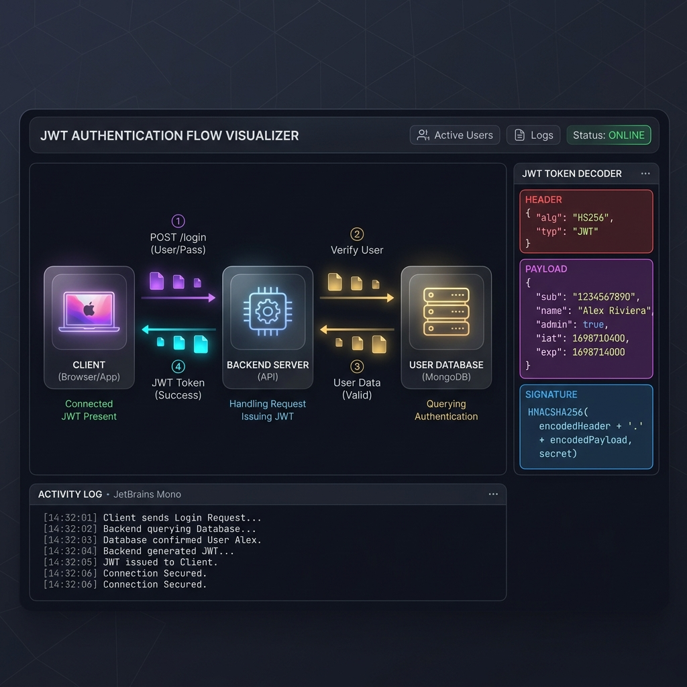
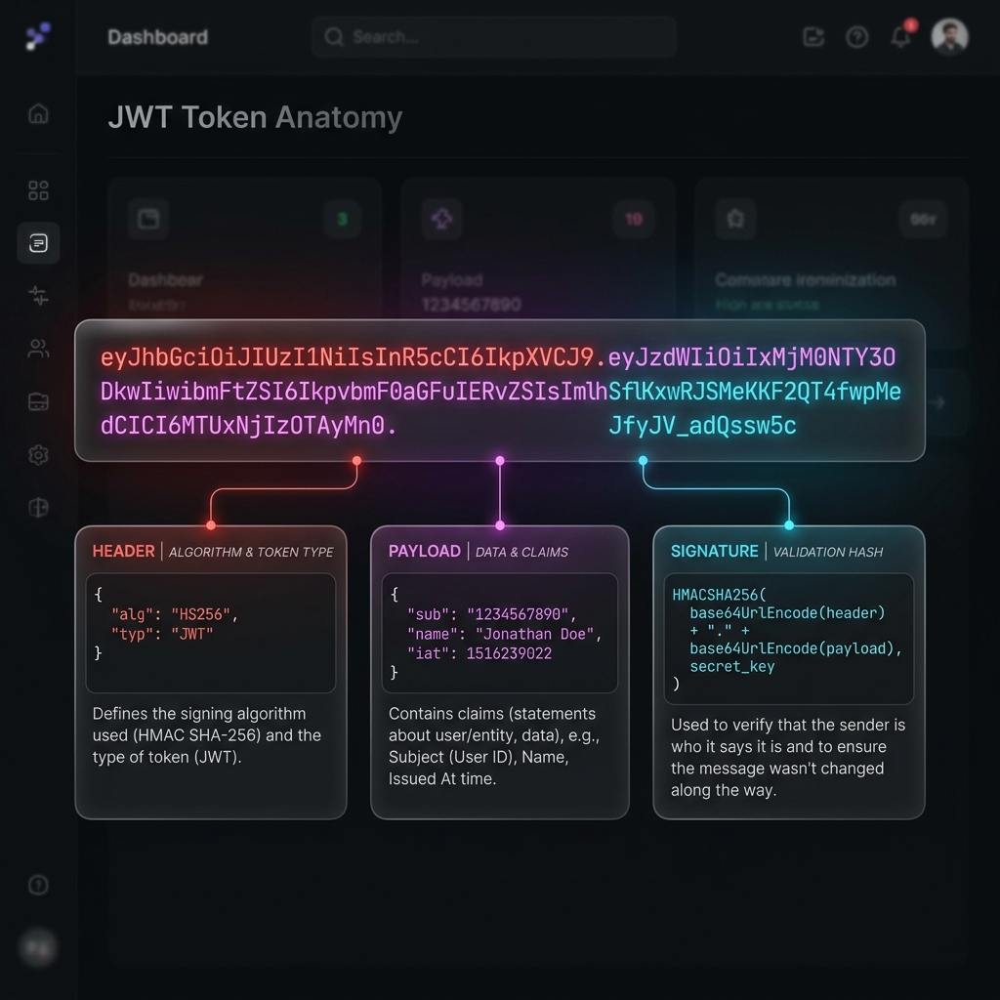

# 🔐 JWT Authentication Flow Visualizer

<div align="center">




</div>

## 📋 Overview

The **JWT Authentication Flow Visualizer** is a high-fidelity, interactive tool designed to demonstrate the complete lifecycle of JSON Web Tokens in a modern web infrastructure. From initial login and database validation to stateless API requests and seamless token renewal, this visualizer demystifies complex security concepts through real-time animations and granular code examples (Spring Boot & React).

### ✨ Key Features

- 📡 **Real-time Flow Simulator** - Smooth, animated packet visualization showing the journey from Client to Database.
- 🔐 **JWT Structure breakdown** - Visual explanation of Header, Payload, and Signature components.
- ⏱️ **Token Lifetime Visualization** - Real-time tracking of Access (15 min) vs Refresh (7 days) token expiration.
- 🛡️ **Security Comparison** - Granular breakdown of Session-based vs Token-based (JWT) architectures.
- 📂 **Best Practices Guide** - Interactive modules for secure token storage (HttpOnly Cookies vs LocalStorage).
- 💻 **Cross-stack Code Examples** - Implementation details for Spring Boot security filters and React interceptors.
- 🔄 **Stateless Scaling Demo** - Visualizes how JWT allows horizontal scaling across multiple servers without shared state.

</br>

## 🚀 Quick Start

### Prerequisites

- 🌐 **Modern Web Browser** (Chrome, Firefox, Safari, or Edge)
- 💾 **No dependencies** (Standalone HTML/CSS/JS)

### 📥 Installation

1. **Clone the repository:**
   ```bash
   git clone https://github.com/yasith-1/JWT-Authentication.git
   cd JWT-Authentication
   ```

2. **Open the Dashboard:**
   Simply open `index.html` in your preferred web browser.

---

## 🛠️ Technology Stack

<div align="center">

| Technology | Purpose | Version |
|------------|---------|---------|
|  | Structure | HTML5 |
|  | Design & Animation | Vanilla |
|  | Visual Logic | ES6+ |
|  | Backend Example | 3.x |
|  | Frontend Example | v18+ |
|  | Typography | Sora / JetBrains Mono |

</div>

---

## 🔄️ Scenarios Visualized

<div align="left">

<details>
<summary>🔑 1. Login & Token Generation</summary>
  
Shows the initial credentials POST request, Database validation (the only DB hit in JWT flow), and the return of signed Access & Refresh tokens.


</details>

<details>

<summary>🛰️ 2. Protected API Request (Stateless)</summary>

Demonstrates how the Client sends the JWT in the Authorization header and how the Server verifies the signature without querying the Database.



</details>

<details>

<summary>🔄 3. Token Refresh Flow</summary>

Visualizes the seamless UX when an Access Token expires and the Refresh Token (stored in HttpOnly Cookie) is used to obtain a new Access Token.


</details>

*Interactive dashboard for deep-diving into JWT security architectures*

</div>

---

## 📁 Project Structure

```
📦 JWT-Authentication-Flow/
├── 📁 css/                # Styling and animations
│   └── 📜 style.css       # Design system and glassmorphism
├── 📁 js/                 # Simulator logic
│   └── 📜 main.js         # Animation sequences and timers
├── 📁 screenshots/        # Visual documentation assets
│   ├── 🖼️ dashboard.png   # Main simulator interface
│   └── 🖼️ anatomy.png     # JWT structure breakdown
├── 📜 index.html          # Unified structure and guide content
└── 📜 README.md           # Documentation (You are here)
```

---

## 🎯 Core Functionalities

<div align="center">
   <table>
<tr>
<td width="50%">

### 🔬 Simulator Logic
- 🔄 Animated flow between 3 nodes
- 🧬 Step-by-step sequential mode
- 💫 Dynamic glow status indicators
- 📊 Real-time action log
- 🏁 Multi-server stateless demo

</td>
<td width="50%">

### 🔐 Token Anatomy  
- 🏗️ Header/Payload/Signature color-coding
- 🏷️ Base64 decode explanations
- ⚙️ HMAC-SHA256 signing demo
- 📱 Mobile-responsive breakdown
- 📏 Access vs Refresh comparison

</td>
</tr>
<tr>
<td width="50%">

### 💻 Code Modules
- 🔌 Spring Boot Dependency set
- ⚡ Secret Key configuration
- 📄 Java JWT Filter implementation
- 🚫 Frontend React interceptors
- 🤖 Comprehensive security best practices

</td>
<td width="50%">

### 🎨 Premium UI/UX
- 🌑 Sleek dark theme
- 🔳 Glassmorphism panels
- 🧩 SVG icons & indicators
- 🎹 JetBrains Mono typography
- ✨ Smooth micro-animations

</td>
</tr>
</table>
</div>

---

## 📞 Contact & Support

<div align="center">

### 👨💻 Developer : Yashith Prabhashwara

[](mailto:yasithprabaswara1@gmail.com)
[](https://www.linkedin.com/in/yashith-prabhashwara-a1aa471a6/)
[](https://github.com/yasith-1)

</div>

---

## 🙏 Acknowledgments

- Inspired by the complexity of modern web security and the need for visual learning.
- Thanks to the open-source community for the badges and design inspiration.
- Built with focus on educational clarity for Full-Stack Developers.

---

<div align="center">

### 🌟 If you found this visualizer helpful, please give it a star! 🌟


**Made with ❤️ by [Yasith Prabaswara](https://github.com/yasith-1)**

</div>
